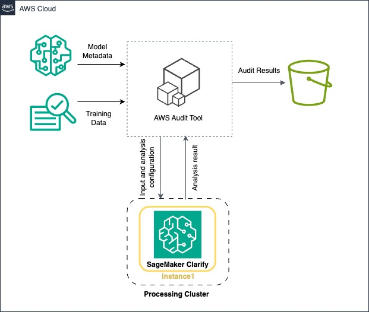
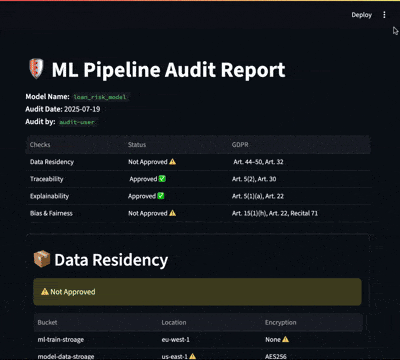

# 🛡️ AI/ML Compliance Audit Tool


This repository contains the first version of an **AI/ML Compliance Audit Tool** designed to evaluate whether machine learning pipelines deployed in **AWS** comply with **GDPR** requirements.  



The tool provides both:
- **Automated auditing logic** (`audit.py`)  
- **Interactive dashboard interface** (`dashboard.py`)  


## 🎯 Motivation
The growing adoption of AI systems raises **compliance and ethical challenges**. Regulations like the **GDPR** require that organizations ensure:  
- Data is stored and transferred responsibly  
- AI systems are **traceable, fair, and explainable**  
- Users’ rights and organizational accountability are respected  

This tool demonstrates how **compliance checks** can be integrated into the ML pipeline lifecycle.  


## 📊 Dashboard Preview
*Placeholder for demo GIF of dashboard interface:*  
  


## 🔎 Compliance Checks Implemented

### 1. **Data Residency**  
- **Why it matters:** GDPR restricts cross-border data transfers (Art. 44–46). Data must stay within approved regions (e.g., EU).  
- **How it’s checked:** The tool verifies S3 bucket locations and ensures data is encrypted.  

### 2. **Traceability & Logging**  
- **Why it matters:** GDPR (Art. 5(2), 30) requires **accountability and auditability**.  
- **How it’s checked:** The tool logs which models are linked to which datasets, buckets, and training jobs. This allows reconstruction of the pipeline for auditing.  

### 3. **Fairness & Bias Metrics**  
- **Why it matters:** GDPR (Art. 5(1)(a), Recital 71) requires fairness and non-discrimination in automated decisions.  
- **How it’s checked:** Using AWS Clarify metrics:  
  - **Accuracy Difference (AD):** Difference in accuracy between groups  
  - **Difference in Positive Proportions in Predicted Labels (DPPL):** Measures group-wise disparities  
  - **Difference in Acceptance Rates (DAR):** Compares acceptance ratios  
  - **Treatment Equality (TE):** Ratio of false negatives to false positives across groups  

### 4. **Explainability**  
- **Why it matters:** GDPR (Art. 22, Recital 71) gives users the right to meaningful explanations of automated decisions.  
- **How it’s checked:** The tool integrates **SHAP (SHapley Additive exPlanations)** to explain model predictions at both global and local levels.  


## ⚙️ Usage

1. Clone & Install
```bash
git clone https://github.com/yourusername/compliance-audit-tool.git
cd compliance-audit-tool
pip install -r requirements.txt 
```
2. Run Compliance Audit
```
python audit.py --bucket <bucket_name> --model <model_name>
```
3. Launch Dashboard
```
streamlit run dashboard.py
```


## 📂 Repository Structure
```
compliance-audit-tool/
│
├── audit.py             # Core compliance checks
├── dashboard.py         # Interactive dashboard
├── README.md            # Project 
```


## 🚀 Future Updates

Planned improvements:
-	Add toy use cases (examples directory) for demonstration
-	Expand checks to consent, policies, access logs, and transfers
-	Generate AWS architecture diagrams per pipeline
-	Add unit tests for each compliance module
-	Provide sample datasets with fairness checks
-	Improve dashboard with real-time monitoring and alerts


## 📖 References
-	[GDPR Full Text](https://gdpr-info.eu/)
-	[AWS SageMaker Clarify](https://docs.aws.amazon.com/sagemaker/latest/dg/clarify-configure-processing-jobs.html)
-	Lundberg & Lee, A Unified Approach to Interpreting Model Predictions, [NeurIPS 2017 (SHAP)](http://papers.neurips.cc/paper/7062-a-unified-approach-to-interpreting-model-predictions.pdf)

---
💡 Note: This is an early-stage prototype. More compliance dimensions will be added in future iterations. Contributions and feedback are welcome!